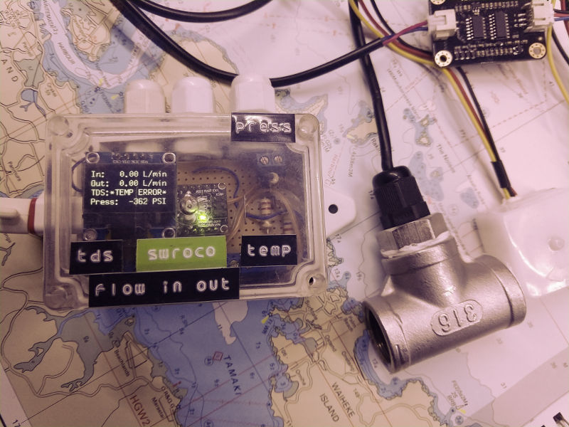

# swroco
Seawater reverse-osmosis watermaker controller

## Hardware
* Arduino Nano
* DFRobot Gravity TDS meter
* DS18B20 Temperature sensor
* 128x64 OLED display
* Flow meter (x2)
* 4-20ma pressure transducer
    https://www.circuitlab.com/editor/#?id=57sybxakkbud
